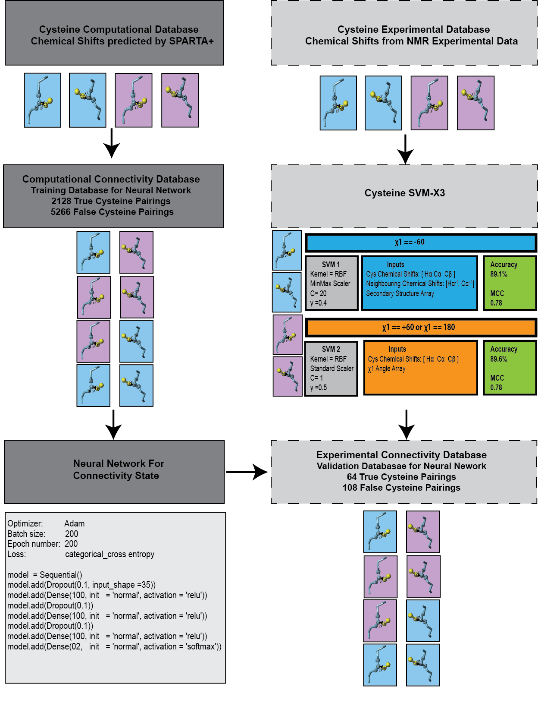

# CrossLink
## A Nerual Network to Predict Disulfide Connectivity in Peptides Using Chemical Shifts
## Background
Disulfide rich peptides are highly desireable drug candidates; either directly as candidates due to exquisite potency or selectivity or as drug scaffolds with their rigid structure and high stability. The disulfide bonds in these peptides act like beams in a bridge, crosslinkng the backbone resulting in highly constrained and stable conformations. The disulfides are crucial to both the structure and function of the peptides. Therefore it is essential to know the correct disulfide bond connectivity (the oxidisation of cysteine side chains to form the bond).

Finding the native connectivity is a factorial problem. A peptide with 3 disulfides has 15 theoretical frameworks, and 4 and 5 disulfides have 105 and 945 possible frameworks respectively. Currently there are no definitive computational or experimental methods to resolve the connectivity framework for native peptides.

We recently showed that disulfides like to adopt specific shapes (called configurations) based on their five dihedral angles, and that the configuration can be predicted based on chemical shift inputs (https://github.com/davarm/DISH_prediction). Expanding on this concept, we developed a multi-stage workflow called CrossLink, that predicts the configuration of individual cysteine residues. These predictions in combination with chemical shifts are then used as inputs in a neural network for the prediction of the connectivity state for cysteine isomers. The program achieved a baseline accuracy of 85% and >95% for high probability predictions. 

## Method
The workflow of the program is :
  - Start with a peptide sequence, with no knowledge of the connectivity framework
  - Using a support vetor machine developed in scikit-learn, predict the X3 angle for each individual cysteine. The X3 angle can either be     +90 or -90 degrees
  - Generate all possible pairings (isomers) of cysteine residues. Pairings where the X3 angles do not match are removed (as this is a         shared bond, therefore should always be the same)
  - For each individual pairing predict if cysteines are bonded or not based on a neural network. Inputs include chemical shift and           structural inputs

# Use
- The suppor vector machine was developed in scikit learn
- The neural network was developed with Theano using Keras frontend

